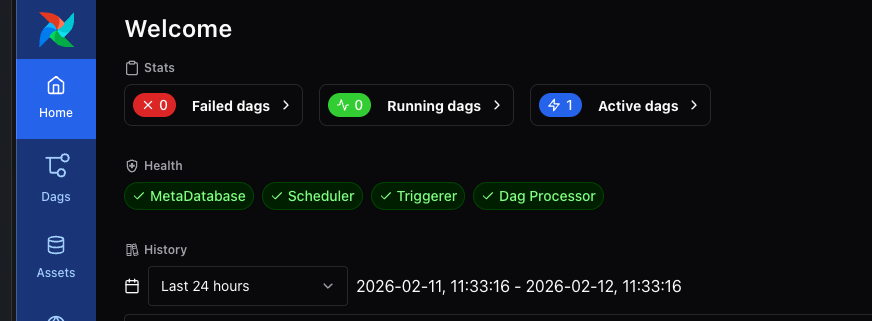

# **Orchestrating Data Pipelines Across Multiple MWAA Environments: Event-Driven Asset Scheduling with SQS**

## **Introduction**

As organizations scale their data operations across multiple AWS accounts, coordinating workflows between isolated Amazon MWAA environments presents unique challenges. Traditional approaches relied on time-based polling, custom sensors, or complex API integrations that introduced latency, operational overhead, and tight coupling between systems.

This blog post explores an event-driven approach to cross-MWAA orchestration using Apache Airflow 3.0.6's Asset Watchers - a fully decoupled architecture using SQS queues for enterprise-scale event-driven workflows.

**What's New in Airflow 3.0.6?**

Apache Airflow 3.0.6 introduces several key changes relevant to cross-MWAA orchestration:
- **Datasets renamed to Assets** - The concept remains the same, but terminology has changed
- **Asset Watchers** - New capability to monitor external event sources (SQS, Kafka, etc.)
- **Event-driven scheduling** - Assets can now be updated by external systems, not just internal DAG tasks
- **New SDK structure** - Imports moved to `airflow.sdk` for core components

These features enable workflows to react to real-world events from systems outside Airflow, eliminating polling overhead and reducing orchestration latency from minutes to seconds.

To accelerate adoption, we also provide a **Claude Code agentic skill** — an AI-powered tool that generates production-ready producer and consumer DAG files through a conversational interface. Rather than manually adapting code templates and navigating the nuances of Asset Watcher configuration, SQS message structures, and provider version requirements, engineers can describe their pipeline in natural language and receive correctly structured, deployment-ready DAGs in seconds. The skill encodes the best practices, gotchas, and patterns from this post directly into its code generation logic, reducing the gap between learning the architecture and deploying it.


## **Solution Overview**

This guide demonstrates cross-MWAA orchestration using Event-Driven Asset Watchers:

**Use when:** You need fully decoupled, event-driven architecture
- Producer publishes messages to SQS queue
- Asset Watcher monitors SQS and updates asset state
- Consumer DAG triggered by asset updates
- Requires Airflow 3.0.6

**Key Benefits:**
- Maximum decoupling between producer and consumer
- Supports multiple consumers for same events
- Integrates with external systems beyond Airflow
- Enterprise-grade reliability with SQS message durability
- No direct network connectivity required between environments
- Accelerated implementation via the included agentic skill that generates correctly structured DAGs from natural language and automates deployment

A **Claude Code agentic skill** accompanies this solution, enabling engineers to generate customized producer and consumer DAGs through natural language conversation. The skill handles two modes: generating sample DAGs for quick validation of the cross-account setup, or producing custom DAGs tailored to specific business logic (e.g., "producer runs a Glue job, consumer triggers dbt"). It can also auto-deploy the generated DAGs — discovering MWAA environments, uploading files to S3, validating requirements and VPC networking, and verifying triggerer health — all with user confirmation at each step.


## Architecture Overview

The event-driven approach represents maximum decoupling and scalability:

### Event-Driven with Asset Watchers
```
┌─────────────────────────────────────┐
│         Account A (Producer)        │
│  ┌──────────────────────────────┐   │
│  │      MWAA Environment 1      │   │
│  │  ┌────────────────────────┐  │   │
│  │  │  Producer DAG          │  │   │
│  │  │  publishes to SQS      │  │   │
│  │  └──────────┬─────────────┘  │   │
│  │             │                │   │
│  │             ▼                │   │
│  │  ┌────────────────────────┐  │   │
│  │  │  Publish to SQS        │──┼───┐
│  │  └────────────────────────┘  │   │
│  └──────────────────────────────┘   │
└─────────────────────────────────────┘
                                      │
                                      ▼
                             ┌─────────────────┐
                             │   Amazon SQS    │
                             │   Queue         │
                             │  (Decoupled)    │
                             └────────┬────────┘
                                      │
┌─────────────────────────────────────┤
│         Account B (Consumer)        │
│  ┌──────────────────────────────┐   │
│  │      MWAA Environment 2      │   │
│  │  ┌────────────────────────┐  │   │
│  │  │  Asset Watcher         │◄─┼───┘
│  │  │  (monitors SQS)        │  │
│  │  └──────────┬─────────────┘  │
│  │             │ updates        │
│  │             ▼                │
│  │  ┌────────────────────────┐  │
│  │  │  Consumer DAG          │  │
│  │  │  schedule=[asset]      │  │
│  │  └────────────────────────┘  │
│  └──────────────────────────────┘
└─────────────────────────────────────┘
```

**Flow:**
1. Producer DAG publishes message to SQS queue
2. Asset Watcher (running in consumer MWAA's triggerer) polls SQS
3. Asset Watcher updates asset state when message arrives
4. Consumer DAG automatically triggers


## **Prerequisites**

**Before implementing this solution, ensure you have:**

- Two Amazon MWAA environments, potentially in different AWS accounts
- MWAA environments running Apache Airflow 3.0.6+
- Basic familiarity with Apache Airflow DAG authoring
- AWS CLI configured with necessary credentials
- IAM permissions to modify MWAA execution roles
- IAM roles configured for cross-account SQS access
- Permissions to create and configure SQS queues


## Implementation

### **Agentic Skill for DAG Generation and Deployment**

The repository also includes an agentic skill (`agent-skill/`) that automates the DAG creation and deployment workflow. The skill follows the universal [SKILL.md](https://github.com/anthropics/skills) format — a portable, structured guide that encodes domain knowledge for AI agents. This means it works across AI coding assistants and agent frameworks, not just a single tool.

**What the skill does:** When you tell your AI coding assistant something like *"Write cross-account MWAA DAGs for my orders pipeline"*, the skill guides the agent through the complete workflow — collecting your SQS queue URL, generating correctly structured producer and consumer DAG files, and optionally deploying them to your MWAA environments. The skill does not require you to provide AWS account IDs or MWAA environment names upfront. Instead, it auto-discovers your environments by running `aws mwaa list-environments` and `aws sts get-caller-identity` using your locally configured AWS CLI credentials, then asks you to confirm which environment is the producer and which is the consumer.

The skill works in two modes:
- **Sample mode** — generates the reference producer and consumer DAGs for quick cross-account validation, requiring only the SQS queue URL as input
- **Custom mode** — adapts the DAG templates to your specific business logic (e.g., *"the producer runs a Glue ETL job and the consumer triggers a dbt model refresh"*), customizing DAG IDs, task names, schedules, and processing logic while preserving the correct Asset Watcher patterns

Beyond code generation, the skill includes an auto-deploy flow that discovers existing MWAA environments, runs pre-flight checks (VPC networking, provider versions, triggerer health, SQS queue accessibility), uploads DAGs to the correct S3 buckets, and verifies end-to-end readiness. Each step that modifies infrastructure requires explicit user confirmation.

#### Installing the Skill Across AI Coding Tools

The skill uses the universal `SKILL.md` format, which is supported by a growing ecosystem of AI coding assistants and agent frameworks. Copy or symlink the `agent-skill/` directory to the appropriate location for your tool:

| Tool | Skill Location | Install Command |
|------|---------------|-----------------|
| [Claude Code](https://docs.anthropic.com/en/docs/claude-code/overview) | `.claude/skills/` | `cp -r agent-skill .claude/skills/mwaa-cross-account/` |
| [Kiro CLI](https://kiro.dev/) | `.kiro/skills/` | `cp -r agent-skill .kiro/skills/mwaa-cross-account/` |
| [Amazon Q CLI](https://docs.aws.amazon.com/amazonq/latest/qdeveloper-ug/command-line.html) | `.amazonq/skills/` | `cp -r agent-skill .amazonq/skills/mwaa-cross-account/` |
| [CLI Agent Orchestrator](https://github.com/awslabs/cli-agent-orchestrator) | Managed via CLI | `cao skills add ./agent-skill` |
| [Strands Agents SDK](https://strandsagents.com/docs/user-guide/concepts/plugins/skills/) | Via SDK plugin loader | Follow Strands skill plugin docs |
| Other tools (Codex, Gemini CLI, Cursor, GitHub Copilot, etc.) | Varies | Check your tool's docs for skill/prompt loading conventions |

When using the [CLI Agent Orchestrator (CAO)](https://github.com/awslabs/cli-agent-orchestrator), skills are delivered to each provider automatically — Kiro CLI receives them as native `skill://` resources, while Claude Code, Codex, Gemini CLI, and others receive them via runtime prompt injection. See the [CAO skills documentation](https://github.com/awslabs/cli-agent-orchestrator?tab=readme-ov-file#skills) for details on managed skill delivery across providers.

Then ask your AI coding assistant:

```
> Write cross-account MWAA DAGs for my orders processing pipeline
```

The assistant will follow the skill's step-by-step guide, collect your SQS queue URL, generate the DAG files, and walk you through deployment.

### Step 1: Set Up the MWAA Environments

Before configuring cross-environment orchestration, you need MWAA environments in both producer and consumer accounts. Below are instructions for creating a consumer environment using the AWS CLI. Repeat similar steps for the producer environment in Account A.

**1a. Create the S3 bucket for DAGs and requirements:**

```bash
# Set your bucket name
MWAA_BUCKET="<YOUR_MWAA_BUCKET>"

# Create the S3 bucket (must be in the same region as your MWAA environment)
aws s3 mb s3://$MWAA_BUCKET --region ap-southeast-2

# Enable versioning (required by MWAA)
aws s3api put-bucket-versioning \
    --bucket $MWAA_BUCKET \
    --versioning-configuration Status=Enabled

# Create the dags folder
aws s3api put-object --bucket $MWAA_BUCKET --key dags/
```

**1b. Create the MWAA execution role:**

Create an IAM role that MWAA will use to access AWS resources. The role needs a trust policy for the Airflow service and permissions for S3 and CloudWatch Logs.

Save the following trust policy to a file called `trust-policy.json`:

```json
{
  "Version": "2012-10-17",
  "Statement": [
    {
      "Effect": "Allow",
      "Principal": {
        "Service": [
          "airflow.amazonaws.com",
          "airflow-env.amazonaws.com"
        ]
      },
      "Action": "sts:AssumeRole"
    }
  ]
}
```

Create the IAM role:

```bash
MWAA_EXECUTION_ROLE="<MWAA_EXECUTION_ROLE>"

aws iam create-role \
    --role-name $MWAA_EXECUTION_ROLE \
    --assume-role-policy-document file://trust-policy.json

# Capture the role ARN for use in Step 1e
MWAA_EXECUTION_ROLE_ARN=$(aws iam get-role \
    --role-name $MWAA_EXECUTION_ROLE \
    --query "Role.Arn" \
    --output text)
```

Attach the base permissions policy that grants access to your MWAA S3 bucket and CloudWatch Logs. This policy is the same for both producer and consumer environments.

> **Note:** The `<ENVIRONMENT_NAME>` placeholder below refers to the name you will give your MWAA environment in Step 1e. Choose the name now (e.g., `mwaa-producer`) and use the same value consistently across the policy and the `create-environment` command.

Save the following to `mwaa-base-policy.json`:

```json
{
  "Version": "2012-10-17",
  "Statement": [
    {
      "Effect": "Allow",
      "Action": "airflow:PublishMetrics",
      "Resource": "arn:aws:airflow:<REGION>:<ACCOUNT_ID>:environment/<ENVIRONMENT_NAME>"
    },
    {
      "Effect": "Deny",
      "Action": "s3:ListAllMyBuckets",
      "Resource": [
        "arn:aws:s3:::<YOUR_MWAA_BUCKET>",
        "arn:aws:s3:::<YOUR_MWAA_BUCKET>/*"
      ]
    },
    {
      "Effect": "Allow",
      "Action": [
        "s3:GetObject*",
        "s3:GetBucket*",
        "s3:List*"
      ],
      "Resource": [
        "arn:aws:s3:::<YOUR_MWAA_BUCKET>",
        "arn:aws:s3:::<YOUR_MWAA_BUCKET>/*"
      ]
    },
    {
      "Effect": "Allow",
      "Action": [
        "logs:CreateLogStream",
        "logs:CreateLogGroup",
        "logs:PutLogEvents",
        "logs:GetLogEvents",
        "logs:GetLogRecord",
        "logs:GetLogGroupFields",
        "logs:GetQueryResults"
      ],
      "Resource": "arn:aws:logs:<REGION>:<ACCOUNT_ID>:log-group:airflow-<ENVIRONMENT_NAME>-*"
    },
    {
      "Effect": "Allow",
      "Action": "logs:DescribeLogGroups",
      "Resource": "*"
    },
    {
      "Effect": "Allow",
      "Action": [
        "cloudwatch:PutMetricData"
      ],
      "Resource": "*"
    },
    {
      "Effect": "Allow",
      "Action": [
        "sqs:ChangeMessageVisibility",
        "sqs:DeleteMessage",
        "sqs:GetQueueAttributes",
        "sqs:GetQueueUrl",
        "sqs:ReceiveMessage",
        "sqs:SendMessage"
      ],
      "Resource": "arn:aws:sqs:<REGION>:*:airflow-celery-*"
    },
    {
      "Effect": "Allow",
      "Action": [
        "kms:Decrypt",
        "kms:DescribeKey",
        "kms:GenerateDataKey*",
        "kms:Encrypt"
      ],
      "NotResource": "arn:aws:kms:*:<ACCOUNT_ID>:key/*",
      "Condition": {
        "StringLike": {
          "kms:ViaService": [
            "sqs.<REGION>.amazonaws.com"
          ]
        }
      }
    }
  ]
}
```

```bash
aws iam put-role-policy \
    --role-name $MWAA_EXECUTION_ROLE \
    --policy-name MWAA-Base-Policy \
    --policy-document file://mwaa-base-policy.json
```

> **Note:** The policy above is a minimal example. For production use, refer to the [Amazon MWAA execution role documentation](https://docs.aws.amazon.com/mwaa/latest/userguide/mwaa-create-role.html) for the full policy template.

In addition to the base policy, the **producer** execution role needs permission to send messages to the cross-account SQS queue. Save the following to `sqs-policy.json`:

```json
{
  "Version": "2012-10-17",
  "Statement": [
    {
      "Effect": "Allow",
      "Action": [
        "sqs:SendMessage",
        "sqs:GetQueueUrl"
      ],
      "Resource": "arn:aws:sqs:<REGION>:<CONSUMER_ACCOUNT_ID>:mwaa-asset-events"
    }
  ]
}
```

```bash
aws iam put-role-policy \
    --role-name <PRODUCER_MWAA_EXECUTION_ROLE> \
    --policy-name SQS-policy \
    --policy-document file://sqs-policy.json
```

> **Note:** The consumer execution role also needs SQS permissions (receive, delete, get attributes) for the Asset Watcher to read from the queue. See the **References** section for guidance on configuring cross-account IAM access.

**1c. Create the VPC networking:**

MWAA requires a VPC with two private subnets in different Availability Zones, a security group with a self-referencing inbound rule, and NAT Gateways for outbound internet access to AWS services (S3, SQS, CloudWatch Logs, etc.).

> **Note:** This template creates a public-network MWAA setup with two public subnets (with NAT Gateways) and two private subnets. The MWAA environment runs in the private subnets while the NAT Gateways in the public subnets provide outbound internet access. If you already have an existing VPC that meets these requirements, you can skip this step and use your existing subnet and security group IDs in Step 1e.

Use the official MWAA VPC CloudFormation template from the [Amazon MWAA documentation](https://docs.aws.amazon.com/mwaa/latest/userguide/quick-start.html) to create the required VPC infrastructure:

```bash
aws cloudformation create-stack \
    --stack-name MWAAEnvironment \
    --template-url https://mwaa-downloads.s3-us-west-2.amazonaws.com/mwaa-vpc-cfn-template.yaml \
    --parameters \
        ParameterKey=EnvironmentName,ParameterValue=MWAAEnvironment \
    --region ap-southeast-2
```

Wait for the stack to complete:

```bash
aws cloudformation wait stack-create-complete \
    --stack-name MWAAEnvironment \
    --region ap-southeast-2
```

Retrieve the subnet IDs from the stack outputs and capture them into variables for Step 1e:

```bash
SUBNET_1=$(aws cloudformation describe-stacks \
    --stack-name MWAAEnvironment \
    --region ap-southeast-2 \
    --query "Stacks[0].Outputs[?OutputKey=='PrivateSubnet1'].OutputValue" \
    --output text)

SUBNET_2=$(aws cloudformation describe-stacks \
    --stack-name MWAAEnvironment \
    --region ap-southeast-2 \
    --query "Stacks[0].Outputs[?OutputKey=='PrivateSubnet2'].OutputValue" \
    --output text)

echo "Subnet 1: $SUBNET_1"
echo "Subnet 2: $SUBNET_2"
```

> **Note:** The CloudFormation template creates a security group with no ingress rules (`no-ingress-sg`), which does not meet MWAA's requirement for a **self-referencing inbound rule**. The following step creates a properly configured security group.

Create a security group with the required self-referencing inbound rule. This allows MWAA's internal components (scheduler, workers, webserver, metadata database) to communicate with each other:

```bash
VPC_ID=$(aws cloudformation describe-stacks \
    --stack-name MWAAEnvironment \
    --region ap-southeast-2 \
    --query "Stacks[0].Outputs[?OutputKey=='VPC'].OutputValue" \
    --output text)

SG_ID=$(aws ec2 create-security-group \
    --group-name mwaa-security-group \
    --description "MWAA environment security group with self-referencing rule" \
    --vpc-id $VPC_ID \
    --region ap-southeast-2 \
    --query "GroupId" \
    --output text)

aws ec2 authorize-security-group-ingress \
    --group-id $SG_ID \
    --protocol all \
    --source-group $SG_ID \
    --region ap-southeast-2

echo "Security Group ID: $SG_ID"
```

Use this `$SG_ID` (not the `NoIngressSecurityGroup` from the stack outputs) when creating the MWAA environment in Step 1e.

**1d. Configure Python requirements and constraints:**

Asset Watchers require the `apache-airflow-providers-amazon` and `apache-airflow-providers-common-messaging` provider packages. MWAA uses a `requirements.txt` file in the S3 bucket root and a constraints file to pin compatible dependency versions.

First, prepare a constraints file based on the [Airflow 3.0.6 constraints](https://github.com/apache/airflow/tree/constraints-3.0.6) and update the pinned versions for the providers you need. Specifically, remove or update the entries for `apache-airflow-providers-amazon` and `apache-airflow-providers-common-messaging` so they don't conflict with the versions specified in `requirements.txt`.

Upload the constraints file to the `dags/` folder:

```bash
aws s3 cp constraints.txt s3://$MWAA_BUCKET/dags/constraints.txt
```

Create an `.airflowignore` file so Airflow doesn't try to parse the constraints file as a DAG:

```
constraints\.txt
```

```bash
aws s3 cp .airflowignore s3://$MWAA_BUCKET/dags/.airflowignore
```

The `requirements.txt` references the local constraints file and specifies the required provider packages:

```
# Airflow 3.0.6 constraints
--constraint "/usr/local/airflow/dags/constraints.txt"

# Required providers for Asset Watchers with SQS
apache-airflow-providers-amazon==9.22.0
apache-airflow-providers-common-messaging==2.0.0

# Dependencies removed from constraints to avoid version conflicts with amazon provider 9.22.0
apache-airflow-providers-common-compat>=1.13.0
apache-airflow-providers-common-sql>=1.32.0
apache-airflow-providers-http>=5.3.3
boto3>=1.41.0
botocore>=1.41.0
```

> **Note:** The constraints file is placed in the `dags/` folder because MWAA syncs this folder to `/usr/local/airflow/dags/` on the worker nodes. The `.airflowignore` prevents the DAG processor from scanning it. Provider versions pinned above are removed from the constraints or upgraded to ensure compatibility with Airflow 3.0.6's Asset Watcher feature.

Upload the requirements file:

```bash
aws s3 cp requirements.txt s3://$MWAA_BUCKET/requirements.txt
```

**1e. Create the MWAA environment:**

With the S3 bucket, IAM role, VPC networking, and requirements all in place, create the environment using the variables captured in the previous steps:

```bash
ENVIRONMENT_NAME="<ENVIRONMENT_NAME>"

aws mwaa create-environment \
    --name $ENVIRONMENT_NAME \
    --airflow-version "3.0.6" \
    --source-bucket-arn "arn:aws:s3:::$MWAA_BUCKET" \
    --dag-s3-path "dags/" \
    --requirements-s3-path "requirements.txt" \
    --execution-role-arn "$MWAA_EXECUTION_ROLE_ARN" \
    --environment-class "mw1.small" \
    --max-workers 10 \
    --min-workers 1 \
    --schedulers 2 \
    --webserver-access-mode "PUBLIC_ONLY" \
    --network-configuration "SubnetIds=$SUBNET_1,$SUBNET_2,SecurityGroupIds=$SG_ID" \
    --logging-configuration '{
        "DagProcessingLogs": {"Enabled": true, "LogLevel": "INFO"},
        "SchedulerLogs": {"Enabled": true, "LogLevel": "INFO"},
        "WebserverLogs": {"Enabled": true, "LogLevel": "INFO"},
        "WorkerLogs": {"Enabled": true, "LogLevel": "INFO"},
        "TaskLogs": {"Enabled": true, "LogLevel": "INFO"}
    }' \
    --airflow-configuration-options '{"dag_processor.refresh_interval": "30"}' \
    --region ap-southeast-2
```

> **Note:** The environment takes approximately 20–30 minutes to reach `AVAILABLE` status. You can monitor progress with:
> ```bash
> aws mwaa get-environment --name $ENVIRONMENT_NAME --region ap-southeast-2 \
>     --query "Environment.Status"
> ```

Repeat these steps for both the **producer** (Account A) and **consumer** (Account B) environments before proceeding.


### Step 2: Create the Cross-Account SQS Queue

First, create an SQS queue that both producer and consumer MWAA environments can access. In the consumer account (Account B), create the queue:

```bash
aws sqs create-queue \
    --queue-name mwaa-asset-events \
    --attributes '{"MessageRetentionPeriod":"86400","VisibilityTimeout":"300"}'
```

Next, attach a resource policy to the queue to allow cross-account access. Save the following to `queue-policy.json`:

```json
{
  "Version": "2012-10-17",
  "Statement": [
    {
      "Effect": "Allow",
      "Principal": {
        "AWS": "arn:aws:iam::<PRODUCER_ACCOUNT_ID>:role/<PRODUCER_MWAA_EXECUTION_ROLE>"
      },
      "Action": [
        "sqs:SendMessage",
        "sqs:GetQueueUrl"
      ],
      "Resource": "arn:aws:sqs:<REGION>:<CONSUMER_ACCOUNT_ID>:mwaa-asset-events"
    },
    {
      "Effect": "Allow",
      "Principal": {
        "AWS": "arn:aws:iam::<CONSUMER_ACCOUNT_ID>:role/<CONSUMER_MWAA_EXECUTION_ROLE>"
      },
      "Action": [
        "sqs:ReceiveMessage",
        "sqs:DeleteMessage",
        "sqs:GetQueueAttributes",
        "sqs:GetQueueUrl"
      ],
      "Resource": "arn:aws:sqs:<REGION>:<CONSUMER_ACCOUNT_ID>:mwaa-asset-events"
    }
  ]
}
```

Apply the policy to the queue:

```bash
aws sqs set-queue-attributes \
    --queue-url https://sqs.<REGION>.amazonaws.com/<CONSUMER_ACCOUNT_ID>/mwaa-asset-events \
    --attributes file://set-queue-attributes.json
```

> **Note:** The `--attributes` parameter expects the `Policy` value as a stringified JSON string, not a nested object. Create `set-queue-attributes.json` with the policy converted to a single escaped string:
> ```json
> {
>   "Policy": "{\"Version\":\"2012-10-17\",\"Statement\":[...]}"
> }
> ```
> See the [SQS SetQueueAttributes API reference](https://docs.aws.amazon.com/AWSSimpleQueueService/latest/APIReference/API_SetQueueAttributes.html) for details. For guidance on cross-account IAM patterns, see the **References** section at the end of this post.

> **Tip:** For simplicity, you can also add the access policy directly from the [Amazon SQS Console](https://console.aws.amazon.com/sqs/) by selecting your queue, navigating to the **Access policy** tab, and pasting the JSON policy above.


### Step 3: Create the Producer DAG with SQS Publishing

In the producer MWAA environment (Account A), create a DAG that publishes asset events to SQS:

> [!IMPORTANT]
> Replace the `queue_url` variable in the `publish_to_sqs` task with your actual SQS queue URL. The placeholder `'https://sqs.<REGION>.amazonaws.com/<CONSUMER_ACCOUNT_ID>/mwaa-asset-events'` must be updated with your AWS region, consumer account ID, and queue name before deploying.

```python
# producer_dag_sqs.py (Airflow 3.0.6)
from airflow.decorators import dag, task
from airflow.providers.amazon.aws.hooks.sqs import SqsHook
from datetime import datetime
import json

@dag(
    dag_id="producer_dag_sqs",
    start_date=datetime(2025, 1, 1),
    schedule="@daily",
    catchup=False,
    tags=["producer", "sqs", "messaging", "taskflow"],
    description="Producer DAG that processes data and sends messages to SQS"
)
def producer_dag_sqs():

    @task
    def process_customer_data():
        """Simulate data processing task"""
        print("Processing customer data...")
        # Simulate some data processing
        processed_data = {
            "customer_id": "CUST-12345",
            "total_orders": 42,
            "revenue": 15000.50,
            "status": "processed"
        }
        return processed_data
    
    @task
    def publish_to_sqs(processed_data, logical_date, dag, run_id):
        """Publish message to SQS queue"""
        try:
            sqs_hook = SqsHook(aws_conn_id='aws_default')
            queue_url = 'https://sqs.<REGION>.amazonaws.com/<CONSUMER_ACCOUNT_ID>/mwaa-asset-events'
            
            # Create message payload
            message = {
                "timestamp": logical_date.isoformat(),
                "dag_id": dag.dag_id,
                "run_id": run_id,
                "data": processed_data
            }
            
            # Send message to SQS
            response = sqs_hook.send_message(
                queue_url=queue_url,
                message_body=json.dumps(message),
                message_attributes={
                    'dag_id': {'StringValue': dag.dag_id, 'DataType': 'String'}
                }
            )
            
            print(f"Successfully published message to SQS: {message}")
            print(f"SQS MessageId: {response.get('MessageId')}")
            return response
            
        except Exception as e:
            print(f"Error publishing to SQS: {str(e)}")
            raise
    
    # Define task dependencies
    data = process_customer_data()
    publish_to_sqs(data)

# Instantiate the DAG
producer_dag_sqs()
```


### Step 4: Configure the Asset Watcher in Consumer Environment

In the consumer MWAA environment (Account B), configure an Asset Watcher to monitor the SQS queue.

>[!IMPORTANT]
>Asset Watchers in Airflow 3.0.6 are defined alongside the Asset itself. Create a DAG file that defines both the asset and its watcher
>
>Replace the queue_url variable in the publish_to_sqs task with your actual SQS queue URL. The placeholder `'https://sqs.<REGION>.amazonaws.com/<CONSUMER_ACCOUNT_ID>/mwaa-asset-events'` must be updated with your AWS region, consumer account ID, and queue name before deploying.

```python
# consumer_dag_sqs.py (Airflow 3.0.6)
from airflow.decorators import dag, task
from airflow.sdk import Asset, AssetWatcher
from airflow.providers.common.messaging.triggers.msg_queue import MessageQueueTrigger
from datetime import datetime
import json

# Define the trigger that polls SQS using the "sqs" scheme
# Parameters after scheme= are passed directly to the underlying SqsSensorTrigger
queue_trigger = MessageQueueTrigger(
    scheme="sqs",
    sqs_queue="https://sqs.<REGION>.amazonaws.com/<CONSUMER_ACCOUNT_ID>/mwaa-asset-events",
    aws_conn_id="aws_default"
)

# Define the asset with the watcher inline
# The AssetWatcher is defined inside the Asset's watchers list, not as a standalone object
queue_asset = Asset(
    "customer_data_sqs",
    watchers=[AssetWatcher(name="sqs_watcher", trigger=queue_trigger)]
)

@dag(
    dag_id="consumer_dag_sqs",
    start_date=datetime(2025, 1, 1),
    schedule=[queue_asset],  # Schedule on the Asset, not the AssetWatcher
    catchup=False,
    tags=["consumer", "sqs", "messaging", "event-driven", "taskflow"],
    description="Consumer DAG triggered by messages in SQS queue"
)
def consumer_dag_sqs():

    @task
    def process_message(**kwargs):
        """Process the message received from SQS"""
        # Access triggering_asset_events from the Airflow context
        triggering_asset_events = kwargs.get("triggering_asset_events")
        if not triggering_asset_events:
            print("No triggering events found")
            return []

        results = []
        for asset, events in triggering_asset_events.items():
            print(f"Asset: {asset}")
            for event in events:
                print(f"Timestamp: {event.timestamp}")
                print(f"Extra: {event.extra}")

                # SQS messages are nested under event.extra["payload"]["message_batch"]
                messages = []
                for msg in event.extra.get("payload", {}).get("message_batch", []):
                    body = json.loads(msg.get("Body", "{}"))
                    messages.append(body)

                results.append({
                    "processed": True,
                    "asset_uri": asset,
                    "timestamp": event.timestamp,
                    "messages": messages
                })

        return results

    @task
    def send_notification(results):
        """Send notification after processing"""
        print(f"Processed {len(results)} event(s) from SQS")
        for result in results:
            print(f"Asset: {result['asset_uri']} at {result['timestamp']}")
            for message in result.get("messages", []):
                print(f"  Message: {message}")

    # Define task dependencies
    result = process_message()
    send_notification(result)

# Instantiate the DAG
consumer_dag_sqs()
```

**How Asset Watchers Work:**
- Asset Watchers run as background processes in the Airflow **triggerer** (not the scheduler)
- The triggerer continuously polls the SQS queue via the `SqsSensorTrigger`
- When a message arrives, the watcher creates an asset event
- Any DAGs scheduled on that asset are automatically triggered
- Messages are deleted from the queue after reception (controlled by `delete_message_on_reception`, default `True`)


### Step 5: Advanced Pattern - Conditional Asset Scheduling

Airflow 3.0.6 supports complex asset dependencies using AND/OR logic. For example, you can configure a consumer DAG to trigger only when multiple assets from different producer environments are all ready, or use OR conditions to trigger when any one of several assets updates.

For details on conditional asset scheduling, asset aliases, and other advanced patterns, refer to the official documentation:

- [Assets](https://airflow.apache.org/docs/apache-airflow/stable/authoring-and-scheduling/assets.html) — defining assets and scheduling DAGs on asset updates
- [Asset Watchers](https://airflow.apache.org/docs/apache-airflow/stable/authoring-and-scheduling/event-scheduling.html) — monitoring external event sources (SQS, Kafka, etc.) to trigger asset updates
- [Conditional Asset Scheduling](https://airflow.apache.org/docs/apache-airflow/stable/authoring-and-scheduling/asset-scheduling.html#advanced-asset-scheduling-with-conditional-expressions) — combining assets with AND (`&`) and OR (`|`) logic


### Step 6: Deploy and Test

Upload the DAGs to their respective MWAA S3 buckets:

```bash
# Upload producer DAG to producer MWAA bucket (Account A)
aws s3 cp producer_dag_sqs.py s3://<PRODUCER_MWAA_BUCKET>/dags/ \
    --profile producer-account

# Upload consumer DAG to consumer MWAA bucket (Account B)
aws s3 cp consumer_dag_sqs.py s3://<CONSUMER_MWAA_BUCKET>/dags/ \
    --profile consumer-account
```

**Testing the Integration:**

1. **Verify the Triggerer is running in the consumer account**:

   Asset Watchers run as background processes in the Airflow **triggerer**, not the scheduler. Before testing, open the consumer MWAA Airflow UI and confirm that the Triggerer component is healthy on the home page under **Health**.

   

   If the Triggerer is not showing as healthy, check that the consumer DAG file has been uploaded correctly and that MWAA has finished installing the required provider packages from `requirements.txt`.

2. **Enable the consumer DAG**:

   Open the consumer MWAA Airflow UI, navigate to the `consumer_dag_sqs` DAG, and toggle it to **enabled** (unpaused). This activates the Asset Watcher, which starts monitoring the SQS queue for new messages. The consumer DAG must be enabled before triggering the producer, so the Asset Watcher is ready to consume messages and automatically trigger the consumer DAG.

3. **Trigger the producer DAG from the Airflow UI**:

   Open the producer MWAA Airflow UI, navigate to the `producer_dag_sqs` DAG, and trigger it manually using the **Trigger DAG** button.

   

   Wait for the DAG run to complete successfully. The `publish_to_sqs` task should show a green (success) status, confirming the message was sent to the SQS queue.

4. **Monitor the SQS queue**:

   After the producer DAG completes, open the [Amazon SQS Console](https://console.aws.amazon.com/sqs/) in the consumer account. Select the `mwaa-asset-events` queue and check the **Monitoring** tab to verify message activity.

   

   > **Note:** If the Asset Watcher is running, it will consume the message quickly, so the queue may already be empty. This is expected behavior.

5. **Verify the consumer DAG is triggered**:

   Navigate to the consumer MWAA Airflow UI. The `consumer_dag_sqs` DAG should have been automatically triggered by the Asset Watcher after it consumed the SQS message.

   

   Check **Browse → Assets** to see the asset event history and confirm the `customer_data_sqs` asset was updated.

   

6. **Confirm the consumer DAG run completes successfully**:

   Once the consumer DAG is triggered, monitor its progress in the Airflow UI. The DAG run should complete with all tasks in a green (success) state.

   

7. **Check the task execution logs**:

   Click on a completed task instance (e.g., `process_message`) in the consumer DAG run to view its execution logs. The logs should show the SQS message payload that was received and processed.

   

**Troubleshooting:**

- **Triggerer not healthy**: Verify the consumer DAG file is syntactically correct and that all provider packages installed successfully. Check MWAA startup logs for import errors.
- **Asset Watcher not starting**: Ensure the consumer DAG with the `AssetWatcher` definition is deployed and that the triggerer is running.
- **Messages not being consumed**: Verify SQS IAM permissions and queue URL match between the producer DAG and the Asset Watcher configuration.
- **Consumer DAG not triggering**: Ensure asset URIs match exactly between the Asset Watcher and the consumer DAG's `schedule` parameter.
- **Messages stuck in queue**: Check triggerer logs for processing errors; may need to purge the queue and resend.

---

## **Cleanup**

To remove the resources created in this walkthrough:

1. **Pause and delete DAGs** in both MWAA environments via the Airflow UI

2. **Delete the MWAA environments** (must be deleted before removing their S3 buckets or IAM roles):
   ```bash
   # Producer environment
   aws mwaa delete-environment --name <PRODUCER_ENV_NAME> --profile producer-account

   # Consumer environment
   aws mwaa delete-environment --name <CONSUMER_ENV_NAME> --profile consumer-account
   ```
   Wait for environments to be fully deleted before proceeding — this takes several minutes:
   ```bash
   aws mwaa get-environment --name <ENVIRONMENT_NAME> --query "Environment.Status"
   ```

3. **Delete the MWAA S3 buckets** (only after environments are fully deleted):
   ```bash
   # Empty and delete producer bucket
   aws s3 rb s3://<PRODUCER_MWAA_BUCKET> --force --profile producer-account

   # Empty and delete consumer bucket
   aws s3 rb s3://<CONSUMER_MWAA_BUCKET> --force --profile consumer-account
   ```

4. **Empty and delete the SQS queue**:
   ```bash
   aws sqs purge-queue --queue-url <QUEUE_URL> --profile consumer-account
   aws sqs delete-queue --queue-url <QUEUE_URL> --profile consumer-account
   ```

5. **Delete IAM roles and policies** — remove cross-account SQS roles, MWAA execution roles, and any policy modifications (only after environments are deleted)

---

## **Conclusion**

Apache Airflow 3.0 introduced advanced event-driven scheduling capabilities, including Asset Watchers that trigger workflows based on external events directly — eliminating the need for separate asset update pipelines. With [Amazon MWAA now supporting Apache Airflow 3.0](https://aws.amazon.com/about-aws/whats-new/2025/10/apache-airflow-3-amazon-mwaa/), you can take advantage of these capabilities as a fully managed service.

In this post, we demonstrated how to use Asset Watchers with Amazon SQS to orchestrate data pipelines across multiple Amazon MWAA environments. By combining SQS message queuing with Airflow's event-driven scheduling, producer and consumer environments remain fully decoupled — no direct network connectivity or API integration is required between them. The producer publishes messages to an SQS queue, and the consumer's Asset Watcher automatically detects new messages and triggers downstream DAGs.

This pattern scales naturally to support multiple consumers reacting to the same events, integrates with external systems beyond Airflow, and leverages SQS's built-in message durability and dead-letter queue support for enterprise-grade reliability.

---

## **References**

- [Assets](https://airflow.apache.org/docs/apache-airflow/stable/authoring-and-scheduling/assets.html) — Apache Airflow documentation on defining assets and scheduling DAGs on asset updates.
- [Asset Watchers](https://airflow.apache.org/docs/apache-airflow/stable/authoring-and-scheduling/event-scheduling.html) — Apache Airflow documentation on monitoring external event sources (SQS, Kafka, etc.) to trigger asset updates.
- [Conditional Asset Scheduling](https://airflow.apache.org/docs/apache-airflow/stable/authoring-and-scheduling/asset-scheduling.html#advanced-asset-scheduling-with-conditional-expressions) — Apache Airflow documentation on combining assets with AND and OR logic.
- [Four ways to grant cross-account access in AWS](https://aws.amazon.com/blogs/security/four-ways-to-grant-cross-account-access-in-aws/) — AWS Security Blog covering four methods for granting cross-account access using resource-based policies.
- [Cross account resource access in IAM](https://docs.aws.amazon.com/IAM/latest/UserGuide/access_policies-cross-account-resource-access.html) — AWS IAM documentation on granting cross-account access using resource policies and IAM roles.

---

## **About the Authors**

[Author bios would go here]
